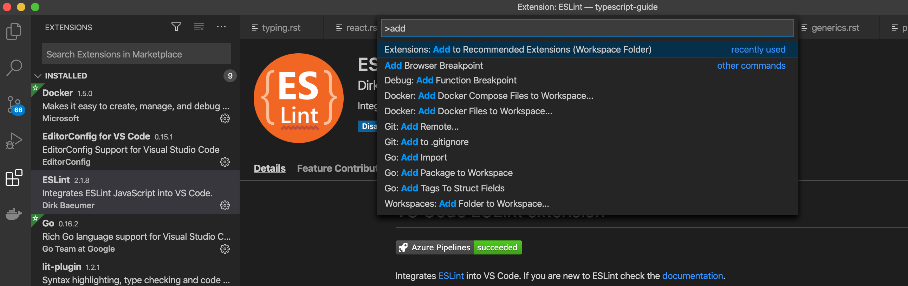
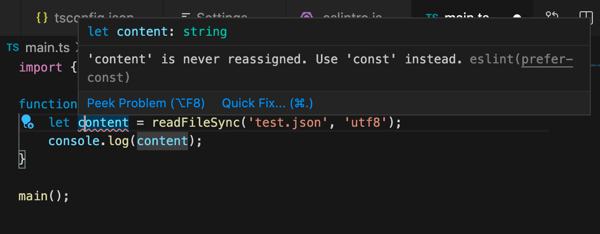

==========================
基本の環境構築
==========================

環境構築の共通部分を紹介しておきます。

プロジェクトでのコーディングであれば、誰が書いても同じスタイルになるなど、コード品質の統一が大切になりますので、単なる個人用の設定ではなく、それをシェアできるというのも目的として説明していきます。

ここでは、基本的にすべてのプロジェクトでJest、ESLint、Prettierなどを選択しています。まあ、どれも相性問題が出にくい、数年前から安定して存在している、公式で推奨といった保守的な理由ですね。きちんと選べば、「JSはいつも変わっている」とは距離を置くことができます。

* Jest

  テスティングフレームワークはたくさんありますが、avaとJestがテスト並列実行などで抜きん出ています。JestはTypeScript用のアダプタが完備されています。avaはBabel/webpackに強く依存しており、単体で使うなら快適ですが、他のBabel Configと相性が厳しくなるのでJestにしています。

* ESLint

  公式が押しているのでこれですね。かつてはTSLintというツールがデファクトスタンダードでしたが、最適化の限界があることなどを理由に、TypeScriptが公式にESLintをメインのLinterとすることが宣言されました。よほどの理由がないかぎりはESLintを使うべきです。

  ESLintはプラグインを使うことでさまざまなルールを足せますし、プラグインを通じて設定を一括で変更できます。これはツール同士の干渉を避けるためだったり、推奨のルールセットを配布する手段として利用されています。

  * @typescript-eslint/eslint-plugin

    ESLintにTypeScriptの設定を追加するプラグインです

* Prettier

  TypeScript以外のSCSSとかにも対応していたりします。現在はシェアが伸びています。EditorConfigというエディタ向けの共通の設定ファイル（ただし、それぞれのエディタでプラグインが必要）を読み込んで利用できます。

  * eslint-config-prettier

    eslint側で、Prettierと衝突する設定をオフにするプラグインです

* npm scripts

  ビルドは基本的にMakefileとかgulpとかgruntとかを使わず、npm scriptsで完結するようにします。ただし、複数タスクをうまく並列・直列に実行する、ファイルコピーなど、Windowsと他の環境で両対応のnpm scriptsを書くのは大変なので、mysticateaさんのQiitaのエントリーのnpm-scripts で使える便利モジュールたちを参考に、いくつかツールを利用します。

* Visual Studio Code

  TypeScript対応の環境で、最小設定ですぐに使い始められるのはVisual Studio Codeです。しかも、必要な拡張機能をプロジェクトファイルで指定して、チーム内で統一した環境を用意しやすいので、推奨環境として最適です。EclipseなどのIDEの時代とは異なり、フォーマッターなどはコマンドラインでも使えるものを起動するケースが多いため、腕に覚えのある人はVimでもEmacsでもなんでも利用は可能です。

.. todo:: lyntのTypeScript対応状況を注視する

これらのツールを組み合わせて環境を作っていきます。昔のJavaScriptの開発環境は、ビルドツール（GruntやGulp）を使ってこれらのツールの組み合わせを手作業をで行う必要がありましたが、ツールが複雑になってプロジェクトのテンプレート化が進んだことや、TypeScriptの人気が上がるにつれてTypeScriptを考慮したツールが増えてきました。そのため、現在は比較的簡単に導入できます。

ツールは日々改良されているため、どの目的に対してどのツールを利用するのがベストかは一概には言えませんが、比較的に広く使われていて、安定していて、かつ利便性が高い物はいくつかピックアップできます。次の表はその対応表になります。フォルダ作成は\ ``package.json``\ を含むプロジェクトのフォルダを作成することを意味します。

最終的にTypeScriptの処理系が何かしらのツール経由で呼ばれ、それをそのツールが結合し、ブラウザやNode.jsで直接実行できるJavaScriptファイルになる部分は変わりません。これらのツールを使ってプロジェクトを作ると、TypeScriptコンパイラを直接呼び出さずにビルドできます。

.. list-table:: TypeScript
   :widths: 10 30 10 10 10
   :header-rows: 1

   - * 対象
     * ツール
     * フォルダ作成
     * TS設定
     * Linter等の設定
   - * Node.js (CLI/Server)
     * `ts-node <https://github.com/TypeStrong/ts-node>`_
     * -
     * ○
     * -
   - * Node.js (CLI/Server)
     * `@vercel/ncc <https://github.com/vercel/ncc>`_
     * -
     * ○
     * -
   - * React
     * `create-react-app <https://reactjs.org/docs/create-a-new-react-app.html>`_
     * ○
     * (オプション)
     * -
   - * React + SSR
     * `Next.js <https://nextjs.org/>`_
     * ○
     * (オプション)
     * -
   - * Vue.js
     * `@vue/cli <https://cli.vuejs.org/>`_
     * ○
     * (オプション)
     * (オプション)
   - * Angular
     * `@angular/cli <https://angular.io/>`_
     * ○
     * ○
     * ○
   - * ウェブ全般
     * `Parcel <https://en.parceljs.org/>`_
     * -
     * ○
     * -

本章では、これらのツール間で共通となる情報を紹介します。

作業フォルダの作成
-------------------------

出力先フォルダの作成はプロジェクト構成ごとに変わってくるため、入力側だけをここでは説明します。プロジェクトごとにフォルダを作成します。ウェブだろうがライブラリだろうが、 ``package.json`` が必要なツールのインストールなど、すべてに必要になるため、 ``npm init`` でファイルを作成します。ツールによってはこのフォルダの作成と\ ``package.json``\ の作成を勝手にやるものもあります。

.. code-block:: bash

   $ mkdir projectdir
   $ cd projectdir
   $ npm init -y
   $ mkdir src
   $ mkdir __tests__

外部に公開しないパッケージの場合には、 ``"private": true`` という設定を忘れずにいれましょう。

srcフォルダ以下に.tsファイルを入れて、出力先のフォルダ以下にビルド済みファイルが入るイメージです。仮にこれを ``dist`` とすると、これはGitでは管理しませんので ``.gitignore`` に入れておきます。

.. code-block:: text
   :caption: .gitignore

   dist
   .DS_Store
   Thumbds.db

もし成果物を配布したい場合は、それとは逆に、配布対象はdistとルートのREADMEとかだけですので、不要なファイルは配布物に入らないように除外しておきましょう。これから作るTypeScriptの設定ファイル類も外して起きましょう。

.. code-block:: text
   :caption: .npmignore

   dist
   .DS_Store
   Thumbds.db
   __tests__/
   src/
   tsconfig.json
   jest.config.json
   .eslintrc
   .travis.yml
   .editorconfig
   .vscode

TypeScriptの環境整備
---------------------------------------------

まずは第一歩としてTypeScriptのコンパイラを入れます。これも環境によっては最初から入っているものもあります。

.. code-block:: bash

   $ npm install --save-dev typescript

設定ファイルは以下のコマンドを起動すると雛形を作ってくれます。これを対象の成果物ごとに編集していきます。

.. code-block:: bash

   $ npx tsc --init

設定ファイルの詳細や、TypeScriptコンパイラを呼び出す部分は各開発環境の章で取り扱います。TypeScriptの処理系は、上記のサンプルの通り、\ ``tsc``\ コマンドですが、これを直接使うことはありません。大抵はwebpackなどのバンドラー経由で使います。コンパイラは単体のファイルの変換機能しかありませんが、TypeScriptが利用される環境のほとんどは、1ファイルにバンドルして配布します。返還後のファイルを塊のファイルにまとめたり、コンパイル結果をメモリ上にキャッシュし、変更のあったファイルだけを素早く変換してプレビューしたりと、コンパイルを行う部分をラップして、よりスマートにビルドします。

Prettier
---------------------------------------------

コードフォーマッターはコードを自動整形するツールです。チーム内で書き方が統一されるため、レビューアの負担は減ります。また、全員が同一のフォーマットで編集するため、コンフリクトが減ったり、コンフリクトの修正作業も楽になります。一方で、後から導入しようとすると、かなりの差分とコンフリクトが発生することもあります。そのため、このフォーマッターはプロジェクト開始時に忘れずに設定しておきましょう。TypeScriptで一番人気はPrettierです。

コードフォーマッターは2つのツールを使います。といっても、Prettierの処理系が2つのフォーマッターを利用できるため、インストールするツールはPrettierのみです。Prettierは自身のルール以外に、editorconfigというフォーマットのためのルール集も利用できるため、この2つを整備します。

まず、最低限、文字コード、インデントとか改行コードの統一はしたいので、editorconfigの設定をします。editorconfigを使えばVisual Studio、Vimなど複数の環境があってもコードの最低限のスタイルが統一されます（ただし、各環境で拡張機能は必要）。また、これから設定するPrettierもこのファイルを読んでくれます。

.. code-block:: bash

   $ npm install --save-dev prettier

.. code-block:: ini
   :caption: .editorconfig

   root = true

   [*]
   indent_style = space
   indent_size = 4
   end_of_line = lf
   charset = utf-8
   trim_trailing_whitespace = true
   insert_final_newline = true

Prettierの設定ファイルも作成します。シングルクオートの有無、末尾のカンマ、セミコロンの有無などが設定できます。詳しくは\ `Prettierのドキュメント <https://prettier.io/docs/en/options.html>`_\ に説明があります。この説明ではEditorConfigの設定との併用を紹介しましたが、Prettier単体の設定ファイルにも同様の機能があるので1つにまとめることも可能です。

.. code-block:: json
   :caption: .prettierrc

   {
       "trailingComma": "es5",
       "semi": true,
       "singleQuote": true
   }

次に\ ``package.json``\ のスクリプトに組み込んで実行してみましょう。エディタへの組み込みを行う場合も、必ず単体で実行できることを確認してから設定すると、設定ミスで時間を溶かすことが減るでしょう。あとからESLintと組み合わせて実行するため、ここでは修飾子つきのコマンド名をあえて設定しています。検証対象のファイルはすべてsrcフォルダにあるものとします。

.. code-block:: json
   :caption: package.json

   {
     "scripts": {
       "fix:prettier": "prettier --write src",
       "lint:prettier": "prettier --check src"
     }
   }

コマンドラインで実行してみて、わざとクオート記号を違うのを設定して、正しく問題が発見できるかみてみましょう。OKなら、次は修正も試してみましょう。なければ次のステップに進みましょう。

.. code-block:: bash

   $ npm run lint:prettier
   Checking formatting...
   [warn] src/main.ts
   [warn] Code style issues found in the above file(s). Forgot to run Prettier?

   $ npm run fix:prettier
   src/main.ts 184ms

Visual Studio Codeの設定
~~~~~~~~~~~~~~~~~~~~~~~~~~~~~~~~~~~~~~~~~~

Visual Studio Codeから利用する場合は、拡張機能と、その設定をファイルに記述しておきます。まずは拡張機能です。

Visual Studio Codeでフォルダを開いたときに、必要な拡張機能がインストールされるようにします。\ ``.vscode``\ フォルダにファイルを作ることで、プロジェクトのソースコードと一緒に、プロジェクトの共有設定を共有できます。同じ拡張機能を入れてもらって、コードチェックなどのクオリティを統一し、コードインテグレーション時に無駄な調整をしなくて済むようにできます。ここではついでにコードのスペルチェックの拡張機能も入れておきます。

この設定はこのJSONを書いても良いですし、拡張機能のページで該当する拡張機能を開いてから、コードパレットで\ ``Extensions: Add to Recommended Extensions (Workspace Folder)``\ を選択すると追加されます。

   拡張機能をプロジェクト推奨に設定

.. code-block:: json
   :caption: .vscode/extensions.json

   {
     "recommendations": [
       "esbenp.prettier-vscode",
       "streetsidesoftware.code-spell-checker"
     ],
     "unwantedRecommendations": []
   }

インストールができたら、次はその拡張機能の設定をします。こちらもプロジェクトのリポジトリにファイルを入れておくことでプロジェクトメンバー間で共通の設定をシェアできます。

Prettierを標準のフォーマッターに指定し、VSCode自身の実行メカニズムを利用してファイル保存時にフォーマットがかかるようにします。  

.. code-block:: json
   :caption: .vscode/settings.json

   {
     "editor.defaultFormatter": "esbenp.prettier-vscode",
     "editor.formatOnSave": true
   }

.. note::

   古い説明の中には、この\ ``editor.formatOnSave``\ を\ ``false``\ にして、ESLintの実行時に同時にフォーマッターが稼働するように設定する人がいます。しかし、可能ならタイピングのたびに稼働して欲しいLinterと同時に毎回フォーマットをかけるのは実行効率や応答性の面でよくありません。本節のように、ESLintはなるべく軽量にしておいて、ファイル保存時のみフォーマッターが稼働するようにすると、応答性が上がります。

ESLint
-------------------

次にESLint関連ツールをインストールして設定します。ESLintは開発するプロジェクトに応じて、さまざまな環境向けにプラグインや事前に設定されたコンフィグをロードして整備していきます。ここで入れるのはTypeScriptをチェックできるようにするとともに、Prettierと喧嘩しないようにするための最低限のプラグインです。テスティングフレームワーク向けの設定などはそれぞれ追加のインストールや設定が必要となります。なお、Vue.jsの場合はそちらからESLintを有効化できますので、そちらを利用してください。

ESLintのインストールと設定はウィザードで作ります。

.. code-block:: bash

   $ npx eslint --init

最初に聞かれる三択の質問は\ **To check syntax and find problems**\ を選びましょう。最後のコードスタイルはAirBnBスタイルとかGoogleスタイルなどを選んでプロジェクトに適用するコードスタイルを決定できますが、すでにPrettierを使って設定済みですので不要です。

モジュール形式はCommon.jsかES6 modulesか、使う場合はReactかVueか、Node.jsなのかブラウザなのか、TypeScriptを使うのかあたりを聞かれます。設定ファイルをどの形式で出力するか、最後に必要なパッケージをnpmでインストールするかも聞かれます。モジュール形式はES6 modulesを、TypeScriptの利用はYを、設定ファイルの形式はJavaScriptを、ツールのインストールはYを選択します。ウェブのフロントエンド、ブラウザ向けかNode.jsか向けかは環境に応じて選択してください。これインストールと設定は8割がた完了です。

ESLintの設定は、機能を追加するプラグインと、設定をまとめて変更するextends、プロジェクト内部で個別に機能を切り替えるのはrulesに書きます。次のサンプルはブラウザ＆React、TypeScriptで生成したものに、Prettier関連の\ ``extends``\ を2つ追加したのと（必ず末尾におくこと）、個別ルールで、開発時のみ\ ``console.log()``\ を許可するように、返り値の型推論を許可しています。また、コールバック関数の利用でよくあるのですが、未使用引数で出る警告はライブラリ側の都合で避けようがなかったりするため、アンダースコアで始まる名前の変数に関しては未使用でも警告が出ないようにしています。

ESLintとPrettierでオーバーラップしている領域があり、ここで追加したextendsはそれらの設定が喧嘩しないようにするためのもので、ESLint側の重複機能をオフにします。React拡張を作成する場合は、Reactバージョンの設定をしないと警告を毎回見ることになるでしょう。 

先ほどの初期化でほとんどのツールはインストール済みですが、Prettierとの連携用設定のパッケージは入っていないので追加します。

.. code-block:: bash

   $ npm install --save-dev eslint-config-prettier

.. code-block:: js
   :caption: .eslintrc.js

   module.exports = {
       env: {
           browser: true,
           es2021: true,
       },
       extends: [
           'eslint:recommended',
           'plugin:react/recommended',
           'plugin:@typescript-eslint/recommended',
           'prettier',
           'prettier/@typescript-eslint',
       ],
       parser: '@typescript-eslint/parser',
       parserOptions: {
           ecmaFeatures: {
               jsx: true,
           },
           ecmaVersion: 12,
           sourceType: 'module',
       },
       plugins: ['react', '@typescript-eslint'],
       rules: {
           'no-console': process.env.NODE_ENV === 'production' ? 2 : 0,
           '@typescript-eslint/explicit-module-boundary-types': 0,
           'no-unused-vars': ['error', { argsIgnorePattern: '^_' } ]
       },
       settings: {
           react: {
               version: "detect",
           }
       }
   };

``"env"``\ はソースコードが対象している環境です。使えるクラスや関数の種類がここで変わります。ここではES2020の宣言が利用できるようにしています。これ以外に設定する可能性があるのは\ ``"browser"``\ か、\ ``"node"``\ 、テスティングフレームワークなどです。必要な方を追加しましょう。

* https://eslint.org/docs/2.0.0/user-guide/configuring#specifying-environments

コマンドラインは、Prettierの項目に追加して、4つ追加しました。2つはESLintのチェックと修正。のこりの2つはPrettierとESLintの一括実行です。

.. code-block:: json
   :caption: package.json

   {
     "scripts": {
       "fix": "run-s fix:prettier fix:eslint",
       "fix:eslint": "eslint src --ext .ts --fix",
       "lint": "run-p lint:prettier lint:eslint",
       "lint:eslint": "eslint src --ext .ts",
     }
   }

修正は直列、チェックは並列実行するようにしています。複数のタスクを並列や並行で実行するには次のコマンドをインストールします。

.. code-block:: bash

   $ npm install --save-dev npm-run-all

再び、試しに実行して、正しくインストールされたか確認します。ここでは一度きりの代入しかないのに、\ ``const``\ ではなく、\ ``let``\ を使うコードで試したものです。次に、修正コマンドも確認してみましょう。問題なければ、ESLintの設定の基本は完了です。

.. code-block:: bash

   $ npm run lint
   /examples/console/src/main.ts
      4:9  error  'content' is never reassigned. Use 'const' instead 

   $ npm run fix

Visual Studio Codeの設定
~~~~~~~~~~~~~~~~~~~~~~~~~~~~~~~~~~~~~~~~~~

こちらも、Prettier同様にVSCodeに追加しましょう。recommendationsに以下の拡張機能を追加します。コードの品質向上を目的として、スペルチェッカーも入れておきましょう。これを入れると英語の単語として存在しないものに青線が引かれるようになります。固有名詞やプロジェクトのキーワードは

.. code-block:: json
   :caption: .vscode/extensions.json

   {
     "recommendations": [
       "streetsidesoftware.code-spell-checker",
       "dbaeumer.vscode-eslint"
	   ],
     "unwantedRecommendations": []
   }

次にプロジェクトでESLintを使うように設定します。

.. code-block:: json
   :caption: .vscode/settings.json

   {
      "eslint.lintTask.enable": true,
      "editor.codeActionsOnSave": {
          "source.fixAll.eslint": true
      }
   }

わざと引っかかるようなコードを書いてみて、赤線が表示され、保存時に\ ``let``\ が\ ``const``\ に書き換わるようになれば完了です。

   
   赤線が引かれるようになった

.. note::

    以前は次に紹介するPrettierをESLintの一部として組み込んで利用することがデファクトスタンダードでした。Lintのエラーもしかし、その場合、チェックのたびにコードをフォーマットしなおし、それからパースして文法のチェックが実行されます。ESLintはコーディングの中でなるべくリアルタイムに結果をプログラマーに提示する方が開発の流れが途切れずに品質の高いコードが量産できます。現在はフォーマッターとこのESLintは同期させないで個別に実行させるのが推奨となっています。

ESLintの警告と特定の行だけ無効化する
~~~~~~~~~~~~~~~~~~~~~~~~~~~~~~~~~~~~~~~~~~~~~

ESLintの警告はなるべく適用したいが、特別なコードだけ除外したいことがあります。逆をやることは基本的になく、なるべく厳しくして、特別な箇所だけ緩めてあげるのが一番やりやすい方法でしょう。例えば、コードジェネレータで生成したコードの警告を無効化したり、変数名の規則はcamelCaseだが、サーバーのレスポンスのみsnake_caseを許容したい場合などがあります。

.. code-block:: ts
   :caption: 特定の行のみ無効化

   const { status_code } = await res.json(); // eslint-disable-line camelcase

   // eslint-disable-next-line camelcase
   const { status_code } = await res.json();

.. code-block:: ts
   :caption: 特定のブロック内のみ無効化

   /* eslint-disable camelcase */

   const { status_code } = await res.json();

   /* eslint-enable camelcase */

これ以外に、.eslintignoreでファイルごと無効化する方法など、さまざまな方法があります。

テスト
-----------

ユニットテスト環境も作ります。TypeScriptを事前に全部ビルドしてからJasmineとかも見かけますが、公式でTypeScriptを説明しているJestにしてみます。

.. code-block:: bash

   $ npm install --save-dev jest ts-jest @types/jest eslint-plugin-jest

scripts/testと、jestの設定を追加します。古い資料だと、transformの値がnode_modules/ts-jest等になっているのがありますが、今はts-jestだけでいけます。

.. code-block:: json
   :caption: package.json

   {
     "scripts": {
       "test": "jest"
     }
   }

.. code-block:: js
   :caption: jest.config.js

   module.exports = {
     transform: {
       "^.+\\.tsx?$": "ts-jest"
     },
     moduleFileExtensions: [
       "ts",
       "tsx",
       "js",
       "json",
       "jsx"
     ]
   };

JestでもMochaでも、人気のフレームワークはテスト専用の関数などが定義されているものとしてテストコードを記述していきますが、これらの関数があるかどうかは、ESLintからは見えません。ESLintにさまざまな設定を追加することで、Jest固有のキーワードでもエラーがでなくなります。

.. code-block:: json
   :caption: .eslintrc.js

   {
     env: {
       :
       'jest/globals': true,
     }
     extends: [
       :
       'plugin:jest/recommended'
       :
     ],
     plugins: [
       "jest"
       :
     ]
   }

.. todo:: tsdocとかドキュメントツールを紹介

.. todo:: eslintやテストの書き方の紹介

