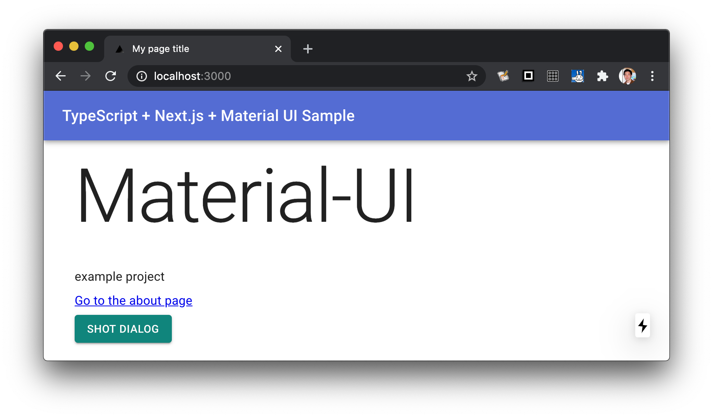

Reactの環境構築
=====================================

ReactはFacebook製のウェブフロントエンドのライブラリで、宣言的UI、仮想DOMによる高速描画などの機能を備え、現在のフロントエンドで利用されるライブラリの中では世界シェアが一位となっています。Reactによって広まった宣言的UIはいまやウェブを超え、iOSのSwift UIやAndroidのJetpack Compose、Flutterなど、モバイルアプリの世界にも波及しており、このコミュニティが近年のムーブメントの発信源となることも増えています。

JavaScriptは組み合わせが多くて流行がすぐに移り変わっていつも環境構築させられる（ように見える）とよく言われますが、組み合わせが増えても検証されてないものを一緒に使うのはなかなか骨の折れる作業で、結局中のコードまで読まないといけなかったりとか、環境構築の難易度ばかりが上がってしまいます。特にRouterとかすべてにおいて標準が定まっていないReactはそれが顕著です。それでも、もう2013年のリリースから長い期間が経ち、周辺ライブラリも自由競争の中で淘汰されたりして、定番と言われるものもかなり定まってきています。環境構築においてもほぼ全自動で済むツール\ ``create-react-app``\ が登場しましたし、オールインワンなNext.jsも利用できます。そろそろ「枯れつつあるフレームワーク」としてReactを選ぶこともできるようになると感じています。

create-react-appによる環境構築
----------------------------------------------------

Reactは標準で環境構築ツールcreate-react-appコマンドを提供しています。これを使って環境構築を行う場合、 ``--template typescript`` オプションをつけるとTypeScript用のプロジェクトが作成できます。

.. code-block:: bash

   $ npx create-react-app --template typescript myapp

   Creating a new React app in /Users/shibukawa/work/myapp.

   Installing packages. This might take a couple of minutes.
   Installing react, react-dom, and react-scripts...
   :
   Happy hacking!

これで開発サーバーも含めて設定は終わりです。次のコマンドが使えます。

* ``npm start``: 開発サーバー起動
* ``npm run build``: ビルドしてHTML/CSS/JSファイルを生成
* ``npm test``: jestによるテストの実行

構築した環境は、すべてをバンドルした\ ``react-scripts``\ というコマンドが開発サーバー、コンパイル、バンドルなどすべてを行います。このスクリプトはカスタマイズのポイントがなく、\ ``tsconfig.json``\ があるだけです。このスクリプトはときに厄介な動きをすることもあります。例えば、\ ``tsconfig.json``\ の変更を勝手に戻したりします。\ ``npm run eject``\ を実行すると、このスクリプトが分解されて\ ``config``\ フォルダに出力されます。これを変更することで、出力先からwebpackの設定まで、細かい内容が変更できるようになります。また、どのような動作が設定されていたのかも確認できます。

Next.js
------------------------------

Next.jsはVercel社が開発しているReactのオールインワンパッケージです。\ ``next``\ コマンドでプロジェクトを作成すると、webpackによるビルドサーバーやコンパイルに必要な設定だけではなく、フロントエンド側の便利機能のCSS in JS、シングルページアプリケーションのためのRouterなどの開発環境整備が完了した環境が一発で作成できます。バージョン9からはTypeScriptにも対応済みのプロジェクトが作成されるようになりました。よく使う部品が最初から設定されているため、ツールやライブラリの調整に手間がかからないのが良い点です。

デフォルトではサーバーサイドレンダリングを行うフロントエンド機能のみですが、カスタムサーバー機能を使えば、Express.jsなどのNode.jsのAPIサーバーにサーバーサイドレンダリング機能などを乗せることができます。Express.jsへの薄いラッパーになりますので、Express.jsの知識を利用して、APIサーバー機能も同一のサーバー上に追加できます。また、サーバーサイドレンダリングを使わずに静的なHTMLとJavaScriptコードを生成することも可能です。

Next.jsの良いところは、よく使うツールやライブラリ一式が検証された状態で最初からテストされている点にくわえ、issueのところでもアクティブな中の人がガンガン回答してくれていますし、何よりも多種多様なライブラリとの組み合わせをexampleとして公開してくれている\ [#]_\ のが一番強いです。
お仕事でやっていて一番ありがたいのはこの相性問題の調査に取られる時間が少なくて済む点です。

それにプラスして、自分で設定すると相当難易度の高いサーバーサイドレンダリング、静的コンテンツの生成など、さまざまなパフォーマンス改善のための機能に取り組んでいます。

.. [#] https://github.com/zeit/next.js/tree/canary/examples

本書執筆時点のバージョンは13です。バージョンが変わると、方法が変わる可能性があります。

次のようにコマンドをタイプし、質問に答えると（プロジェクト名、標準構成で作るかサンプルを作るか）、プロジェクトフォルダが作成されます。

.. code-block:: bash

   $ npx create-next-app@latest --ts

次のコマンドが使えます。

* ``npm run dev``: 開発サーバー起動
* ``npm run build``: ビルドして本番モードのHTML/CSS/JSファイルを生成
* ``npm start``: ビルドしたアプリを本番モードのアプリケーションを起動

以前のバージョンでは少し追加作業が必要でしたが、最新バージョンでは ``--ts`` をつけるだけで設定が終わります。

``tsconfig.json``\ は今までと少し異なります。後段でBabelやSWCといったツールが処理してくれる、ということもあって、モジュールタイプはES6 modules形式、ファイル生成も後続ツールが処理するため\ ``noEmit: true``\ 。
ReactもJSX構文をそのまま残す必要があるので ``"preserve"`` となっています。JSで書かれたコードも一部あるので、\ ``allowJs: true``\ でなければなりません。

Next.jsは\ `CSS Modules <https://github.com/css-modules/css-modules>`_\ に対応しているため、button.tsxの場合、button.module.cssといった名前にすることで、そのファイル専用のCSSを作成できます。
もし、SCSSを使う場合は次のコマンドをタイプすると.module.scssが使えるようになります。

.. code-block:: bash

   $ npm install sass

詳しくはNext.jsの\ `組み込みCSSサポートページ（英語） <https://nextjs.org/docs/basic-features/built-in-css-support>`_\ を参照してください。

Reactの周辺ツールのインストールと設定
--------------------------------------

create-react-appの方はすでに設定済みですが、Next.jsはESLintやテストの設定が行われませんので、品質が高いコードを実装するために環境整備をしましょう。
ESLintを入れる場合は、ReactのJSXに対応させるために、\ ``eslint-plugin-react``\ を忘れないようにしましょう。

.. code-block:: bash

   # テスト関係
   $ npm install --save-dev jest ts-jest @types/jest

   # ESLint一式
   $ npm install --save-dev prettier eslint
   　　 @typescript-eslint/eslint-plugin eslint-plugin-prettier
       eslint-config-prettier eslint-plugin-react npm-run-all 

ESLintはJSX関連の設定や、.tsxや.jsxのコードがあったらJSXとして処理する必要があるため、これも設定に含めます。
あと、next.config.jsとかで一部Node.jsの機能をそのまま使うところがあって、CommonJSのrequireを有効にしてあげないとエラーになるので、そこも配慮します。

.. code-block:: json
   :caption: .eslintrc

   {
     "plugins": [
       "prettier"
     ],
     "extends": [
       "plugin:@typescript-eslint/recommended",
       "plugin:prettier/recommended",
       "plugin:react/recommended"
     ],
     "rules": {
       "no-console": 0,
       "prettier/prettier": "error",
       "@typescript-eslint/no-var-requires": false,
       "@typescript-eslint/indent": "ignore",
       "react/jsx-filename-extension": [1, {
         "extensions": [".ts", ".tsx", ".js", ".jsx"]
       }]
     }
   }

最後にnpmから実行できるように設定します。

.. code-block:: json
   :caption: package.json

   {
     "scripts": {
       "test": "jest",
       "watch": "jest --watchAll",
       "lint": "eslint .",
       "fix": "eslint --fix ."
     }
   }

UI部品の追加
-------------------------

ReactやNext.jsにはかっこいいUI部品などはついておらず、自分でCSSを書かないかぎりは真っ白なシンプルなHTMLになってしまいます。React向けによくメンテナンスされているMaterial Designのライブラリである、Material UIを入れましょう。ウェブ開発になると急に必要なパッケージが増えますね。

* https://material-ui.com/

.. code-block:: bash

   $ npm install --save @material-ui/core @material-ui/icons

create-react-appで作成したアプリケーションの場合の設定方法は以下にサンプルがあります。

* https://github.com/mui-org/material-ui/tree/master/examples/create-react-app-with-typescript

まずは ``src/theme.tsx``\ をダウンロードしてきて同じパスに配置します。これがテーマ設定を行うスクリプトなので色のカスタマイズなどはこのファイルを操作することで行ます。次に\ ``src/index.tsx``\ のルート直下に\ ``ThemeProvider``\ コンポーネントを起き、テーマを設定します。すべてのUIはこのルートの下に作られることになりますが、このコンポーネントが先祖にいると、すべての部品が同一テーマで描画されるようになります。

.. code-block:: ts
   :caption: src/index.tsx

   import React, { StrictMode } from 'react';
   import { render } from 'react-dom';
   import CssBaseline from '@material-ui/core/CssBaseline';
   import { ThemeProvider } from '@material-ui/core/styles';
   import App from './App';
   import * as serviceWorker from './serviceWorker';
   import theme from './theme';

   render(
     <StrictMode>
       <ThemeProvider theme={theme}>
         <CssBaseline />
         <App />
       </ThemeProvider>
     </StrictMode>,
     document.getElementById('root')
   );

Next.jsも同じようなことをする必要がありますが、サーバーサイドレンダリングをする都合上、Next.jsでは少し別の設定が必要になります。下記のサイトにサンプルのプロジェクトがあります。

* https://github.com/mui-org/material-ui/tree/master/examples/nextjs-with-typescript

行うべきは作業は3つです。

* ``pages/_app.tsx``\ をダウンロードしてきて同じパスに配置
* ``pages/_document.tsx``\ をダウンロードしてきて同じパスに配置
* ``src/theme.tsx``\ をダウンロードしてきて同じパスに配置（必要に応じてカスタマイズ）

以上により、ページ内部で自由にMaterial UIの豊富なUI部品が使えるようになります。

Material UI以外の選択肢としては、React専用でないWeb Components製のUI部品もあります。

* Material Web Components: https://github.com/material-components/material-components-web-components
* Ionic: https://ionicframework.com/
* Fast: https://github.com/microsoft/fast

React+Material UI+TypeScriptのサンプル
----------------------------------------------

ページ作成のサンプルです。Next.jsベースになっていますが、このサンプルに関してはcreate-react-appとの差はごく一部です。

* Next.jsはpages以下の.tsxファイルがページになります。このファイルは\ ``pages/index.tsx``\ なので、\ ``http://localhost:3000``\ でアクセスできます。このファイルは\ ``export default``\ でReactコンポーネントを返す必要があります。create-react-app製のコードは\ ``src/index.tsx``\ がルートになっていますが、そこからインポートされている\ ``src/App.tsx``\ がアプリケーションとしてはトップページなので、ここに書くと良いでしょう。
* ``next/head``\ は\ ``<head>``\ タグを生成するコンポーネントになりますが、create-react-appの場合は\ `react-helmet <https://www.npmjs.com/package/react-helmet>`_\ などの別パッケージが必要でしょう。
* ``next/link``\ はシングルページアプリケーションのページ間遷移を実現する特殊なリンクを生成するコンポーネントです。create-react-appでシングルページアプリケーションを実現する場合は\ `React Router <https://reactrouter.com/>`_\ などの別パッケージが必要となります。

TypeScriptだからといって特殊なことはほとんどなく、世間のJavaScriptのコードのほとんどそのままコピーでも動くでしょう。唯一補完が聞かない\ ``any``\ が設定されていたのが\ ``makeStyle``\ でした。これはCSSを生成する時にパラメータとして任意の情報を設定できるのですが、今回はMaterial UIのテーマをそのまま渡すことにしたので、\ ``Theme``\ を型として設定しています。

.. code-block:: ts
   :caption: pages/index.tsx

   import { useState } from 'react';
   import Head from 'next/head';
   import Link from 'next/link';

   import { useTheme, makeStyles, Theme } from "@material-ui/core/styles";
   import { 
     Toolbar,
     Typography,
     AppBar,
     Button,
     Dialog,
     DialogActions,
     DialogContent,
     DialogContentText,
     DialogTitle,
   } from "@material-ui/core";

   const useStyle = makeStyles({
     root: (props: Theme) => ({
       paddingTop: props.spacing(10),
       paddingLeft: props.spacing(5),
       paddingRight: props.spacing(5),
     })
   });

   export default function Home() {
     const [ dialogOpen, setDialogOpen ] = useState(true);
     const classes = useStyle(useTheme());
     return (
       

         <Head>
           <title>My page title</title>
           <meta name="viewport" content="initial-scale=1.0, width=device-width" />
           <link rel="stylesheet" href="https://fonts.googleapis.com/css?family=Roboto:300,400,500,700&display=swap" />
         </Head>
         <Dialog open={dialogOpen} onClose={() => {setDialogOpen(false)}}>
           <DialogTitle>Dialog Sample</DialogTitle>
           <DialogContent>
             <DialogContentText>
               Easy to use Material UI Dialog.
             </DialogContentText>
           </DialogContent>
           <DialogActions>
             <Button
               color="primary"
               onClick={() => {setDialogOpen(false)}}
             >OK</Button>
           </DialogActions>
         </Dialog>
         <AppBar>
           <Toolbar>
             <Typography variant="h6" color="inherit">
               TypeScript + Next.js + Material UI Sample
             </Typography>
           </Toolbar>
         </AppBar>
         <Typography variant="h1" gutterBottom={true}>
           Material-UI
         </Typography>
         <Typography variant="subtitle1" gutterBottom={true}>
           example project
         </Typography>
         <Typography gutterBottom={true}>
           <Link href="/about">
             <a>Go to the about page</a>
           </Link>
         </Typography>
         <Button
           variant="contained"
           color="secondary"
           onClick={() => { setDialogOpen(true)}}
         >Shot Dialog</Button>
         
       

     );
   }

   Next.js + Material UI + TypeScriptのサンプル

ReactとTypeScript
---------------------------

Reactに限らず、近年の流行のウェブフロントエンドの実装スタイルは「コンポーネント」と呼ばれる独自タグを実装していく方法です。コンポーネントの中にもコンポーネントを書くことができます。そのコンポーネントが集まってアプリケーションになります。Reactもその例に漏れず、コンポーネントを実装していきます。

前節のサンプルの中にある、大文字始まりの名前のタグがそのコンポーネントです。それぞれのタグは表示されるときには分解されて、最終的にはHTML5のいつものタグに還元されます。タグなので、引数があり、子要素があります。

ReactはTypeScriptを使って適切に型のチェックができるようになっています。Reactはjsx構文を使って書きますが、これはTypeScriptやBabelといった処理系によってJavaScriptの普通の関数呼び出しに変換されます。React以前のライブラリなどは、テンプレートをフロントで効率よく実行するためのに、動的に関数呼び出しのコードを生成し、\ ``eval``\ などを使って関数に変換したりしていました。近年ではこれらはContent-Security-Policyでエラーになる可能性があるなどの問題もあり、ビルド時にプログラム化するようになってきました。

Reactはこのテンプレートの変換を処理系が直々に行うので、別途変換のプリプロセッサを入れる必要がないというメリットもあるのですが、それ以上に入力パラメータの間違いなどを、普通の関数の型チェックと同様に行えるという、他のフロントエンドのフレームワークにはないメリットがあります。このチェックを最大限に生かすのも、それほど手間をかけずに行えます。次のコードはTypeScriptを用いてReactコンポーネントを作るときによく使う要素を詰め込んだものです。

* 外部からの引数（props）
* コンポーネント内で管理するステート（\ ``useState()``\ ）
* 初期化コード、終了コード（\ ``useEffect()``\ ）
* デフォルト値

.. code-block:: jsx

   import React, { useState, useEffect } from 'react'

   // コンポーネントのプロパティ（タグの属性）
   type Props = {
     title: string;
     description?: string;
     defaultValue: string;
   };

   // コンポーネントは関数
   // 返り値が最終的に描画されるHTMLタグ
   export function MyComponent(props: Props) {
     // propsを参照
     const { title, description } = props;
     // コンポーネント内のステート
     const [count, setCount] = useState(0);
     // ライフサイクルメソッド
     useEffect(() => {
       // 作成時（初回レンダリング直後）に呼ばれる箇所
       return () => {
         // 終了時に呼ばれる箇所
       };
     }, []);

     return (
       

         <h1>{title}

         { description ? <section>{description}</section> : null }
         <button onClick={() => setCount(count + 1)}>{count}</button>
       

     );
   };

   // 省略時のデフォルトのプロパティ
   MyComponent.defaultProps = {
     defaultValue: 'default';
   };

これらのうち、引数の関数のプロパティにきちんと型をつけ、\ ``defaultProps``\ に値を設定すれば、利用時にエラーチェックが行われるようになります。また、関数内部の\ ``useState()``\ は初期値に設定した値を元に型推論が行われます。2つの要素のタプルを返しますが、 前者は初期値と同じ型の即値が入った変数、後者はステートを更新するための関数（初期値と同じ型の1の引数のみを持つ）です。これらのおかげで、自分のコンポーネントを作成するときも、その作成したコンポーネントを利用するときも、型の恩恵が受けられます。

コンポーネントを外部公開する場合に、\ ``Props``\ をexportする必要はありません。コンポーネントから\ ``ComponentProps<>``\ を使って導出が可能です。もし継承拡張するニーズがあったとしても、コンポーネントだけexportしておけば利用側でアクセスできます。余計なものをexportしない方がプログラムの依存関係はよりシンプルになります。

.. code-block:: ts

   import React, { ComponentProps } from 'react';
   import { MyComponent } from './my-component';

   type MyComponentProps = ComponentProps<typeof MyComponent>;

ただし、\ ``defaultProps``\ で初期値を与えていてもそれは\ 反映されません。そのため、利用側の印象と一致させるために、\ ``defaultProps``\ を与える場合は、\ ``Props``\ 定義に\ ``?``\ を追加しておきましょう。

.. code-block:: ts

   type Props = {
     title: string;
     description?: string;
     defaultValue?: string; // こうしておくべきだった
   };

ReduxとTypeScript
---------------------------

Reactの周辺のライブラリの作者の中にはTypeScriptを使わない人が多くいました。Reactは元々Facebookが開発していたflowtypeを使うことが多かったり、ReactのJavaScriptの記述法がかなりトリッキーだったり、と理由はいろいろ考えられます。その後、MicrosoftがReactを大々的に利用するように宣言し、TypeScriptの機能もかなり充実しました。近年ではTypeScriptの型定義ファイルが最初から付属するようになったり、TypeScriptで再実装されたり、TypeScriptとの親和性がどんどん上がっています。

Reduxはアプリケーション内部で横断的に利用したいデータを保持したり、その更新を行うための補助ライブラリです。データの更新にともない、必要な画面更新だけを効率的に行えるようにもしてくれます。大規模なアプリケーションではよく活用されていました。そのRedux本体も、TypeScriptで適切に型をつけていこうとするとかなり頭と手を使う必要がありましたが、公式サポートライブラリのRedux-Toolkitは、TypeScriptとの親和性が極めて高くなりました。素のReduxをこれから扱う理由は特にないので、本書ではRedux-Toolkit経由でのReduxの操作について紹介します。

Reduxはストアと呼ばれる中央のデータ庫を持ちます。データに変更を加えるためのreducerと呼ばれる変換ロジックを実装します。標準のReduxを使う場合は、reducerのみを実装します。この関数の返り値がステートになります。データの保管そのものはReduxが行い、開発者が触ることはできません。必要に応じてreducerをReduxが実行し、その結果をReduxが管理するという構成です。

このreducerをトリガーするのに必要なのが、アクションと呼ばれるデータでした。これを\ ``dispatch()``\ という関数に投げ込むことでreducerが起動され、そのアクションに応じてデータを書き換えていました。

しかし、まずJavaScriptの文化で、アクションクリエーターというアクションを作る関数を作っていました。この場合、型をつけるにはreducerの引数にはすべてのアクションの型（アクションクリエーターの返り値の型）の合併型を作る必要がありました。この「すべての」というのが大きなアプリケーションになると依存関係が循環しないように気をつけたり、漏れなく型を合成してあげないといけなかったりと、型のために人間が行う作業が膨大でした。多くの人が「Reduxに型をつけるには？」という文章を書いたりしましたが、その後、Reduxが公式で出してきた解答がRedux-Toolkitでした。

Redux-Toolkitは次のような実装になります。スライスというステートとreducer、アクションクリエーターがセットになったオブジェクトを作成します。Reducerの引数のstateは\ ``Readonly<>``\ をつけておくと、デバッグで問題の追跡が難しい不測の事態が発生するのを未然に防げます。

.. code-block:: ts
   :caption: スライスを作成

   import { createSlice, configureStore, PayloadAction } from '@reduxjs/toolkit';

   // stateの型定義
   export type State = {
     count: number;
   };

   // 初期状態。インラインで書いても良いですが・・・・
   const initialState: State = {
     count: 0
   };

   // createSliceでreducerとactionを同時に定義
   const counterSlice = createSlice({
     name: 'counter',
     initialState,
     reducers: {
       incrementCounter: (state: Readonly<State>, action: PayloadAction<number>) => ({
         ...state,
         count: state.count + action.payload,
       }),
       decrementCounter: (state: Readonly<State>, action: PayloadAction<number>) => ({
         ...state,
         count: state.count - action.payload,
       }),
     },
   })

スライス自体はReduxのストアを作る材料ではありますが、もうひとつ、アクションクリエーターのオブジェクトも結果に格納されています。これをエクスポートしてコンポーネントから利用できるようにします。

.. code-block:: ts

   // action creatorをスライスから取り出して公開可能
   // dispatch経由でコンポーネントのコードから呼び出せる
   export const { incrementCounter, decrementCounter } = counterSlice.actions;

スライスからストアを作るには\ ``configureStore()``\ を使います。管理対象が少なければ、スライス作成からストア作成まで１ファイルでやりきってもいいでしょう。複雑になる場合は、スライス作成部分をファイルに切り出しましょう。

.. code-block:: ts
   :caption: スライスからストアを作成

   // sliceからstoreを作る
   export const store = configureStore({
     reducer: counterSlice.reducer,
   });

   // 複数のsliceからstoreを作るにはreducerにオブジェクトを渡せばOK
   export const store = configureStore({
     reducer: {
        counter: counterSlice.reducer,
        primenumber: primenumberSlice.reducer,
     }
   });

さらに型チェックを強固にするために、コンポーネントとのインタフェースとなる関数群にもきちんと型をつけておきます。上記の\ ``store``\ を作るファイルで一緒にやってしまうと良いでしょう。

.. code-block:: ts
   :caption: 利用側との接点となる型情報付き関数を生成

   import {
     useSelector as useReduxSelector,
     TypedUseSelectorHook,
   } from 'react-redux';

   export type RootState = ReturnType<typeof store.getState>;
   export const useSelector: TypedUseSelectorHook<RootState> = useReduxSelector;
   export type AppDispatch = typeof store.dispatch;

Reduxとの大きな違いは、内部で管理するステートの初期値とその型を明示的に宣言できるようになったことです。Reduxではreducerの引数とそのデフォルト値が初期値でした。いろいろなところで活用しますし、ステートの加工にあたってもチェックや補完が欲しいところなので、補完も期待通りに行われますし、エラーメッセージもわかりやすくなります。

``reducers``\ の中身が実際に値を加工する操作が入っています。この関数では変更前のステートを受け取り、それに値を設定して関数の返り値として返します。Reduxと違い、1つの関数の中に自分で\ ``switch``\ 文を書くのではなく、このオブジェクトのキー単位で操作の単位として独立しています。

アプリケーション側との接点は2か所です。アプリケーション全体の設定と、値を利用したいコンポーネントです。

.. code-block:: jsx
   :caption: アプリ全体で一カ所、storeを設定

   import { store } from '../redux/store';
   import { Provider } from 'react-redux';

   function App() {
     return (
       <Provider store={store}>
         <Router>
           <Switch>
             <Route exact path="/"><RootPage /></Route>
             <Route path="/edit"><EditPage /></Route>
           </Switch>
         </Router>
       </Provider>
     )
   }

各コンポーネントでは\ ``useSelector()``\ と\ ``useDispatch()``\ を使ってストアへの読み書きを行ます。

.. code-block:: ts
   :caption: Reduxのステートを利用する関数側

   // Reduxの提供のuseDispatch
   import { useDispatch } from 'react-redux';
   // スライス側からアクションクリエーター
   import { incrementCounter } from '../redux/counterslice';
   // ストア側からは型をつけたuseSelectorとDispatch用の型定義
   import { useSelector, AppDispatch } from '../redux/store';

   export function MyComponent() {
     const dispatch = useDispatch<AppDispatch>();
     const counter = useSelector(state => state.counter);
     return (
       

         <!-- ストアのステートを利用 -->
         <h1>count: {counter.count}</h1>
         <!-- dispatchでストアに変更を加える -->
         <button onClick={() => dispatch(incrementCounter(10))} />
       

     )
   }

要注意なポイントは、スライスの名前です。複数のスライスをまとめてReduxの最終的なステートを作り上げますが、この名前がかぶっていると、変更していないはずなのにいつのまにか値が変更されていたりといったトラブルが発生します。

ReactとReduxの非同期アクセス
---------------------------------

Reactの基本の書き方とRedux-Toolkitを使って型チェックが完全な形で行われるようになりました。サーバーサイドレンダリングの仕組みやstyled-componentを使ったスタイリング、Routerによるシングルページアプリケーションのページ切り替えなど、追加の情報や便利ライブラリは別にありますが、Reactに関する最新の基礎知識はほぼこれでカバーできたと言えます。

しかし、もう1つ触れておかなければならないことがあります。それが非同期のデータアクセスです。

画面の表示に必要なデータの取得や結果の格納でサーバーアクセスが必要になることがあります。サーバーアクセスが一切ないウェブフロントエンドはあまりないでしょう。静的サイトジェネレータから呼び出す場合はまたそちらの作法がありますが、今回は通常のウェブアプリケーションのフロントエンドの説明を行ます。

まず表示に利用する情報の取得です。コンポーネント単体で取得、あるいはRedux経由の利用があります。一番簡単なコンポーネント内部で完結する方法を紹介します。コンポーネント内部で呼び出す場合は\ ``useEffect()``\ を利用します。注意点としては、\ ``useEffect()``\ にはasync関数を渡すことができない点です。後始末の処理を\ ``return``\ で返すというAPI設計の制約による気がしますが、利用側としては従わざるをえません。asyncな関数を作り、それを呼び出します。

このコードは、ブラウザ標準APIの\ ``fetch``\ を使い、最終的に\ ``useState()``\ 提供の関数\ ``setData()``\ で取得してきた値を格納しています。もしエラーがあれば、同様に\ ``setShowErrorDialog()``\ に格納しています。

.. code-block:: ts

   // サーバーデータ
   const [data, setData] = useState({loaded: false} as Data);
   // エラーダイアログ表示用ステート
   const [showErrorDialog, setShowErrorDialog] = useState('');

   useEffect(() => {
     async function getData() {
       const res = await fetch('/api/getdata');
       let data: Data;
       if (res.ok) {
         try {
           data = await res.json() as Data;
         } catch (e) {
           setShowErrorDialog(`parse error ${e}`);
           return;
         }
       } else {
         setShowErrorDialog(`server access error`);
         return;
       }
       setData(data);
     }
     getData();
   }, []);

Redux-Toolkitのreducersにはそのままでは非同期処理が書けません。\ ``createAsyncThunk()``\ を使い、それを\ ``extraReducers``\ の中で登録します。

.. code-block:: ts
   :caption: 非同期のreducer

   import { createAsyncThunk } import '@reduxjs/toolkit';

   type fetchLastCounterReturnType = {
     count: number;
   };

   export const fetchLastCounter = createAsyncThunk<fetchLastCounterReturnType>(
     'lastcount/fetch',
     async (arg, thunk): Promise<fetchLastCounterReturnType> => {
       const res = await fetch('/api/lastcount', {
          credentials: 'same-origin',
       });
       if (res.ok) {
          return (await res.json()) as fetchLastCounterReturnType;
       }
       throw new Error('fetch count error');
     }
   );

   const counterSlice = createSlice({
     name: 'counter',
     initialState,
     reducers: {},
     extraReducers: builder => {
       builder.addCase(fetchLastCounter.fulfilled,
         (state, action) => {
           return {
             ...state,
             count: action.payload.count
           };
         }
       );
     }
   })

これも、\ ``dispatch(fetchLastCounter())``\ のように呼び出せます。この非同期アクションに引数を設定したい場合は、createAsyncThunkの2つ目の型パラメータに引数を設定します。型パラメータに入れずにasyncの関数側の\ ``arg``\ にだけ型を付けようとしてもエラーになるので注意してください。

.. code-block:: ts

   type fetchLastCounterArgType = {
     counterName: string;
   };

   const fetchLastCounter = createAsyncThunk<
     fetchLastCounterReturnType,
     fetchLastCounterArgType
   >(
     'lastcount/fetch',
     async (arg, thunk) {
       // 略
     }
   );

この非同期アクションからReduxのストアに値を設定する方法が2つあります。1つが上記の登録方法で紹介した\ ``extraReducers``\ です。\ ``pending``\ 、\ ``fulfilled``\ 、\ ``error``\ の3つの状態に対して\ ``reducer``\ が書けます。それぞれ、実行開始直後、完了後、エラー発生のときに呼ばれます。これが一番簡単です。

もう片方が、データ格納用のreducerを別個に作成し、非同期アクションから呼び出す方法です。2つ目の引数の\ ``thunk``\ には\ ``getState()``\ や\ ``dispatch()``\ といった、Redux本体とアクセスするメソッドがあります。これらを使い、ステートの状態を取得しつつ、\ ``dispatch()``\ で個別に作成したreducerに呼ぶことで、ステートに結果を書き込むことができます。基本的には前者の方法で済むことが多いでしょう。

これらの非同期アクションを呼び出して結果をコンポーネントから利用する方法は2つあります。ひとつはすでに紹介した\ ``useSelector()``\ 経由で情報を取得してくる方法です。もう1つは、結果を直接受け取る方法です。後者は\ ``dispatch()``\ の結果を\ ``unwrapResult()``\ に渡すことで、正常終了したときの結果が得られます。

.. code-block:: ts
   :caption: ``unwrapResult``\ を使った例

   import { unwrapResult } import '@reduxjs/toolkit';

   useEffect(() => {
     async function getData() {
       const ret = unwrapResult(await dispatch(fetchLastCounter()));
       dispatch(fetchUpdateLog(ret.count, username));
     }
     getData();
   }, []);

Reactの昔からよく発生するコーディングのミスとして、ステートへ格納した直後に結果を読み出そうとしてもまだ更新されていない、というものがあります。\ ``useState()``\ のセッターで設定したステートやReduxのストアの状態は、次の更新時まで変更されません。更新してしまうと、一つのレンダリング関数の中で、変数の状態が複数存在する可能性が発生してしまい、整合性を保つのが困難になります。しかし、その副作用として、結果を更新したものを使う場合に、次の更新まで待たなければならなくなります。

しかし、非同期の呼び出しがきちんと期待通りに呼ばれるかどうかというのはうまく動かなかった時の問題追跡が困難です。そのため、サーバーの結果を受けて再度何かサーバーアクセスを行う場合などは、途中でReactの再描画を待つのではなく、一つのasync関数の中で処理を完結させる方がバグが出にくく、コードの行数も短くなり、見通しの良いコードになります。

次のコードはぱっと見たときに\ ``useEffect()``\ 同士の依存関係が見えません。コードを読み解くと、\ ``fetchLastCounter()``\ の結果がReduxのステートに格納され、その数値が書き換わったことで、2つ目の\ ``useEffect()``\ が呼ばれることが分かりますが、お世辞にも分かりやすいとは言えません。TypeScriptの可視性のすぐれた\ ``async``\ /\ ``await``\ を使うべきです。

.. code-block:: ts
   :caption: ``unwrapResult``\ を使わない例

   const counter = useSelector(state => state.counter);

   useEffect(() => {
     dispatch(fetchLastCounter());
   }, []);

   // 分割されたuseEffect
   useEffect(() => {
     dispatch(fetchUpdateLog(counter.count, username));
   }, [counter.count]);

Reactの新しい書き方
--------------------------------

Reactは歴史のあるコンポーネントで、途中でいくつも機能追加が行われたり改善されています。1つのことを実現するのに新旧何通りもやり方が提供されていたりします。新しい書き方が作られるのは、もちろん、そちらの方がミスが少なかったり、コードが短くなったりと改善が見込まれるからです。Reactの場合はTypeScript的にも優しい書き方となっているため、もし古いコーディング規約に従っている場合は新しい書き方に整理していくと良いでしょう。

2019年2月にリリースされたReact 16.8のHooksにより、新しい書き方に大々的に移行可能になりました。もしこれ以前から続いているプロジェクトの場合、新しくつくるコンポーネントや、改修を行うコンポーネントから徐々に移行していくと良いでしょう。

クラスコンポーネントではなく、関数コンポーネントにする
~~~~~~~~~~~~~~~~~~~~~~~~~~~~~~~~~~~~~~~~~~~~~~~~~~~~~~~~~~~~~~~~~~~~~

まずは古いTypeScript以前の書き方です。お決まりの書き方だけでもかなりの行数になってしまいます。

.. code-block:: js
   :caption: 古い書き方

   import React, { Component } from "react";
   import propTypes from "prop-types";

   class MyComponent extends Component {
       constructor(props) {
           super(props);
           this.state = {
               count: 0;
           }
           this.onClick = this.onClick.bind(this);
       }

       componentDidMount() {
           // サーバーアクセスなどのマウント後に実行したいコードはここ
       }

       componentWillUnmount() {
           // 削除前に実行したいコードはここ
       }

       onClick() {
           this.setState({
               count: this.state.count + 1;
           });
           this.Props.onUpdated(this.state.count + 1);
       }

       render() {
           return (
               

                   

                       <button onClick={this.onClick}>{this.props.label}</button>
                   

               

           );
       }
   }

   MyComponent.propTypes = {
       label: PropTypes.string
       onUpdated: PropTypes.func
   }

   MyComponent.defaultProps = {
       label: "押して下さい"
   };

これ以降、JavaScriptやTypeScriptへの機能追加により、何段階か書き方の改善がありました。コンストラクタで\ ``onClick``\ をbindしなおさずに、class定義の中で代入できるようになったので、アロー演算子を使っているかもしれませんし、TypeScript化で\ ``Component``\ の型変数でPropsやStateの型変数を設定するようになっているかもしれません。

.. code-block:: ts
   :caption: ほどほどに古い書き方

   interface Props {
       label: string;
       onUpdated: (count: number) => void;
   }

   interface State {
       counter: number;
   }

   // TypeScriptで型定義
   export class MyComponent extends Component<Props, State> {
       // コンストラクタではなく、クラス定義の中で代入文
       private state: State = {
           counter: 0,
       };
       // アロー演算子でイベントハンドラ実装
       private onClick = () => {
           this.setState({counter: this.state.counter + 1});
       }
       render() {
           // :ここは同じ
       }
   }

古い書き方でTypeScriptを使わなくても、Reactレベルでさまざまなチェック機構が提供されており開発は便利ではありました。ただし、\ ``state``\ の変更処理（\ ``setState()``\ 呼び出し）をした直後にはまだインスタンス変数の\ ``this.state``\ が変更されておらず、状態がおかしくなってしまう、という問題があったり、イベントハンドラをJSXに渡すときに、thisの束縛を忘れてイベントが発火した後にエラーになるといったミスがおきやすい素地がありました。

現在主流になっているのが関数コンポーネントです。当初は状態を持たないコンポーネントのみだったため、クラスコンポーネントからの完全移行は大変でしたが、Hookという機能が追加されてクラスコンポーネントを完璧に置き換えられるようになりました。関数コンポーネントは状態管理をReact側におまかせして、\ ``render()``\ のみにしたような書き方です。だいぶ、縦にも横にも圧縮されたことがわかります。

.. code-block:: ts
   :caption: 新しい書き方

   import React, { useState, useEffect } from "react";

   type Props = {
       label?: string;
       onUpdated: (count: number) => void;
   };

   export function MyComponent(props: Props) {
       const [count, setCount] = useState(0);
       const {label, onUpdate} = props;

       useEffect(() => {
           // サーバーアクセスなどのマウント後に実行したいコードはここ
           return () => {
               // 削除前に実行したいコードはここ
           }
       }, []);

       function onClick() {
           setCount(count + 1);
           onUpdated(count + 1);
       }

       return (
           

               

                   <button onClick={onClick}>{label}</button>
               

           

       );
   }

   MyComponent.defaultProps = {
       label: "押して下さい"
   };

一番短くなってミスがおきにくくなったのは\ ``state``\ 周りです。\ ``useState()``\ に初期値を渡すと、現在の値を保持する変数と、変更する関数がペアで返ってきます。初期値から型推論で設定されるため、Stateの型定義を外で行う必要はなくなります。\ ``setState()``\ で変更したものが直後に変更されているはず、と誤解されることもなくなりました。もう一度レンダリングが実行されないと変数の値が変更されないのは\ ``useState()``\ の宣言を見ればあきらかです。

イベントハンドラの\ ``this``\ の束縛もなくなります。もはや単なる関数であって、オブジェクトではないため、\ ``this``\ を扱う必要もなくなります。横方向に圧縮されたのは\ ``this.``\ がたくさん省略されたからです。

いくつかのライフサイクルメソッドが削除されたり、名前が変わったりはありますが、以前のコードもそのまま動きますので、全部を一度に移行する必要はありません。

サードパーティのライブラリもHooksを使う
~~~~~~~~~~~~~~~~~~~~~~~~~~~~~~~~~~~~~~~~~~~~~~~~~~~~~~~~~~~~~~~~~~~~~

関数コンポーネント自体もコードを短くする効能がありますが、新しいHooksスタイルにより、サードパーティのライブラリの組み込みも簡単になります。残念ながら、Hooksスタイルの関数は関数コンポーネントでしか利用できませんので、前述の関数コンポーネントへの書き換えがまず必要になります。

例えば、React-RouterやReduxとの接続は、コンポーネントをラップしてpropsに要素を追加する関数呼び出しが必要でした。ユーザーコード側では、サードパーティのライブラリから何かしら情報をもらったり、サードパーティのライブラリの機能を呼び出しするには、\ ``props``\ 経由で扱う必要があり、この特殊なラッパーは\ ``props``\ に新しい属性を増やす役割を果たしていました。しかし、ユーザーコード側でも\ ``propsTypes``\ にこれを追加する必要があったりと、たくさんの転記作業が必要でした。コンポーネントの外の状態まで気を配る必要がありました。

.. code-block:: js
   :caption: 古いReact-Routerのラッパースタイルの書き方

   import React, { Component } from "react";
   import { withRouter } from "react-router-dom";

   export class MyComponent extends Component {
       onClick() {
           // ページ遷移
           this.props.history.push("/new-path");
       }
       render() {
           // :
       }
   }

   // サードパーティを使う側に知識が必要なポイント
   MyComponent.props = {
       history: PropTypes.object.isRequired,
   };

   // ここでラップ！
   const MyComponent = withRouter(MyComponent);

Hooksに対応したReact-Routerのv5移行であればコンポーネントの中で履歴を触るためにコンポーネントの外にまで手を加える（ラップしたりPropsを変更する）必要はなくなりました。ここでも、縦にも横にも短くなったことがわかるでしょう。React-Routerの機能にアクセスするための壮大な準備コードが不要になりました。　

.. code-block:: ts
   :caption: 新しい履歴へのアクセス方法

   import React from "react";
   import { useHistory } from "react-router-dom";

   export function MyComponent( {
       const history = useHistory();

       onClick() {
           history.push("/new-path");
       }

       return (
           // :
       );
   }

よく不要論が取り沙汰されるReduxも、Reduxのストアにアクセスしたり、変更のために\ ``dispatch``\ を呼ぶときにその準備コードが多くなる問題がありました。次のコードは、コンポーネント定義自体は全部省略して空ですが、これだけの準備コードが必要でした。　

.. code-block:: js
   :caption: Reduxの古い書き方

   import React, { Component } from "react";
   import { connect } from "react-redux"

   class MyComponent extends Component {
      ...
   }

   // PropTypesへの追加が必要
   MyComponent.propTypes = {
       counter: PropTypes.object,
       onClick: PropTypes.func,
       dispatch: PropTypes.func,
   }

   // このマッピング関数の定義は必要
   function mapStateToProps(state, props) {
       return {
           counter: state.reducer.counter
       };
   }

   // connectでpropsにdispatchが増えるので、connectの2つめの
   // このマッピングは使わずにdispatchをコンポーネント内部で呼び出す
   // ことも可能
   function mapDispatchToProps(dispatch) {
       return {
           // アクションはオブジェクトそのままではなくアクションクリエータとして切り出されている場合も
           onClick: () => dispatch({ 
               type: Actions.DISPATCH_EVENT,
               hoge: true,
           }),
       }
   };

   const MyComponent connect(mapStateToProps, mapDispatchToProps)(Test);
   export MyComponent;

``dispatch()``\ のマッピングはしていませんが、\ ``dispatch()``\ やReduxのストアへのアクセスは2つのHooksスタイルの関数で完了します。劇的ですね。Reduxのストア定義自体も、本章の中で紹介したRedux-Toolkitを使うことで大幅に短く書けるようになりました。

.. code-block:: ts
   :caption: Reduxの新しい書き方

   import { useDispatch, useSelector } from 'react-redux';

   export function MyComponent() {
       const dispatch = useDispatch();
       const counter = useSelector(state => state.counter);
   }

なお、\ ``useDispatch()``\ と\ ``useSelector()``\ ですが、本章の中で触れた通りに、Redux-Toolkitのストアの定義のついでに型付けをしておくと、コンポーネント内部でも型の恩恵を最大限に得ることができます。

React-Routerにしても、Reduxにしても、はたまたスタイル定義のライブラリだったりにしても、一種類だけの適用であれば、探せばサンプルコードや情報も出てきますし、初心者でも調べ物しながらなんとかできる範囲ではありますが、複数のコンポーネントが登場し始めて設定周りのコードが絡みだすと、情報が減り、トラブル発生時のシューティングが難しくなります。コードを読む人も、どこから手を付けて良いのか分かりにくくなってきます。

同じ機能を実装するにしても、コードが縦にも横にも短く、儀式的なコードが減れば、ライブラリや技術へのキャッチアップコストも減りますし、読んで理解するのも簡単になります。また、型の恩恵も受けやすいとなると、開発がかなり加速するでしょう。

まとめ
-----------------------------------------------------

これで一通り、Reactを使う環境ができました。最低限の設定ですが、TypeScriptを使ったビルドや、開発サーバーの起動などもできるようになりました。

フロントエンドは開発環境を整えるのが大変、すぐに変わる、みたいなことがよく言われますが、ここ10年の間、やりたいこと自体は変わっていません。1ファイルでの開発は大変なので複数ファイルに分けて、デプロイ用にはバンドルして1ファイルにまとめる。ブラウザにロードしてデバッグする以前にコード解析で問題をなるべく見つけるようにする。ここ5年ぐらいは主要なのコンポーネントもだいたい固定されてきているように思います。State of JavaScript Surveyという調査をみると、シェアが高いライブラリはますますシェアを高めていっており、変化は少なくなってきています。一方で、React自体はより良い書き方ができるように進歩しています。

* https://2019.stateofjs.com/

CoffeeScriptや6to5に始まり、Babel、TypeScriptと、AltJSもいろいろ登場してきましたが、TypeScriptの人気は現在伸び率がナンバーワンです。それに応じて、各種環境構築ツールもTypeScriptをオプションの一つに加えており、ドキュメントでも必ず言及があります。デフォルトでTypeScriptが利用できるというツールも増えてきています。

本章の内容も、最初に書いたときよりも、どんどんコンパクトになってきています。もしかしたら、将来みなさんが環境構築をする時になったら本書の内容のほとんどの工程は不要になっているかもしれません。それはそれで望ましいので、早くそのような時代がきて、お詫びと訂正をしたいと思います。
