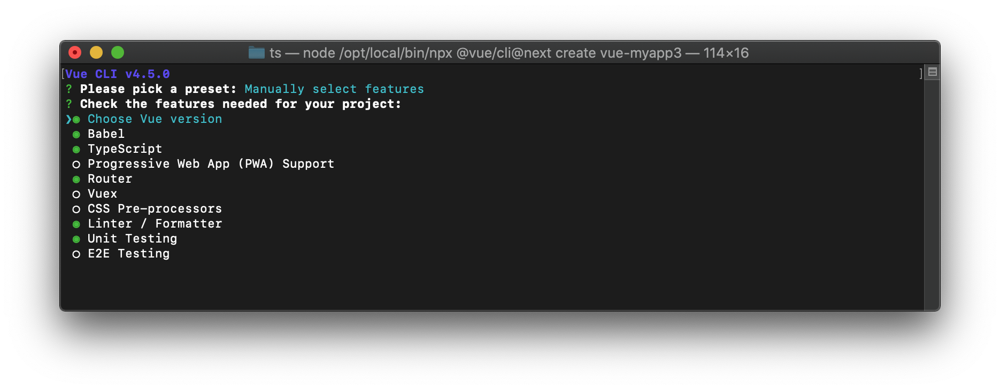

Vue.jsの環境構築
===========================

Vue.jsは日本で人気のあるウェブフロントエンドのフレームワークです。柔軟な設定のできるCLIツールが特徴です。本書では3系についてとりあげます。

.. code-block:: bash

   $ npx @vue/cli@next create myapp

作成時に最初に聞かれる質問でdefaultのpreset（babelとeslint）ではなく、Manually select featuresを選択します。

.. figure:: images/vue-cli-1.png

   TypeScriptを選択する場合はManually select featuresを選択

次のオプションで必要なものをスペースキーで選択して、エンターで次に進みます。選んだ項目によって追加の質問が行われます。Routerやステート管理などのアプリケーション側の機能に関する項目以外にも、LinterやユニットテストフレームワークやE2Eテストの補助ツールなど、さまざまなものを選択できます。

   必要な機能を選択する

途中で、クラスベースかそうではないか、という質問が出てきます。以前ではクラスベースのAPIの方がTypeScriptとの相性がよかったのですが、Vue.js3からの新しいAPIで、クラスベースでない時も型チェックなどに優しいComposition APIが追加されました。そこはチームで好きな方を選択すれば良いですし、あとから別のスタイルにすることもできます。

.. figure:: images/vue-cli-3.png

  クラススタイルのコンポーネントを利用するか？

現在のVue.jsのプロジェクトのほとんどは、\ ``.vue``\ ファイルに記述するシングルファイルコンポーネント（SFC）を使っていると思いますが、TypeScriptを使う場合、スクリプトタグの\ ``lang``\ 属性を\ ``ts``\ になっています。

.. code-block:: html

   <template>
     HTMLテンプレート
   </template>
   
   

クラスベースのコンポーネント
-----------------------------------------

クラスベースのコンポーネントはvue-class-componentパッケージを使い、デコレータをつけたクラスとして実装します。クラスのインスタンスのフィールドがデータ、ゲッターが算出プロパティになっているなど、TypeScriptのプレーンな文法とVueの機能がリンクしており、ウェブフロントエンドを最初に学んだのではなく、言語としてのTypeScriptやJavaScript、他の言語の経験が豊富な人には親しみやすいでしょう。環境構築のCLIのオプションではデフォルトでこちらになるような選択肢になっています。

以下のコードはVue.js 3系のクラスベースのコンポーネント実装です。

.. code-block:: ts

   

これをラップしてより多くのデコレータを追加したvue-property-decoratorというパッケージもあります。こちらの方が、\ ``@Prop``\ や\ ``@Emit``\ でプロパティやイベント送信も宣言できて便利でしょう。

   * https://www.npmjs.com/package/vue-property-decorator

.. warning::

   ただし、現時点で3.0系で変わったvue-class-componentの変更にはまだ追従していないように見えます。

関数ベースのコンポーネント作成
-----------------------------------------

Vue本体で提供されている\ ``defineComponent()``\ 関数を使いコンポーネントを定義します。今までのオブジェクトをそのまま公開する方法と違い、この関数の引数のオブジェクトの型は定まっているため、以前よりもTypeScriptとの相性が改善されています。このオブジェクトの属性で名前や他の依存コンポーネント、Propsなどを定義するとともに、\ ``setup()``\ メソッドでコンポーネント内部で利用される属性などを定義します。

.. code-block:: ts

   

.. note::

   **Nuxt.jsを使ったプロジェクト作成**

   Vue.jsにも、Vue.jsをベースにしてサーバーサイドレンダリングなどの自分で設定すると大変な機能がプリセットになっているNuxt.jsがあります。
   Nuxt.jsの場合は、通常の設定の後に、いくつか追加のパッケージのインストールや設定が必要です。日本語によるガイドもあります。

   * https://typescript.nuxtjs.org/ja/guide/setup.html
